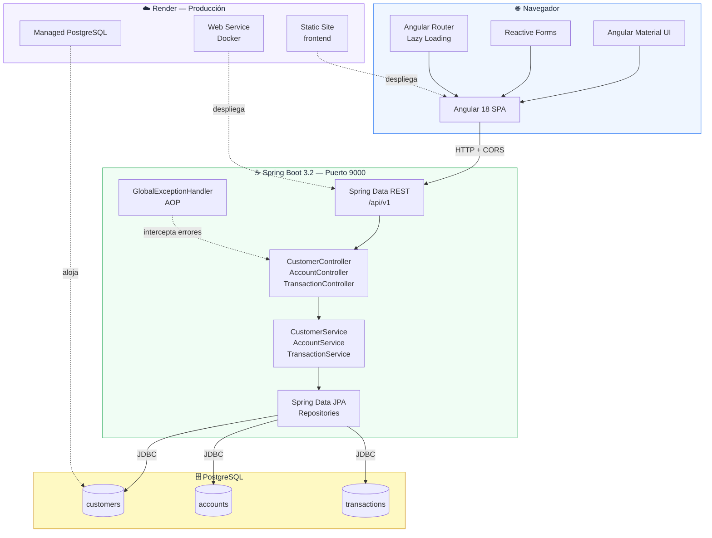
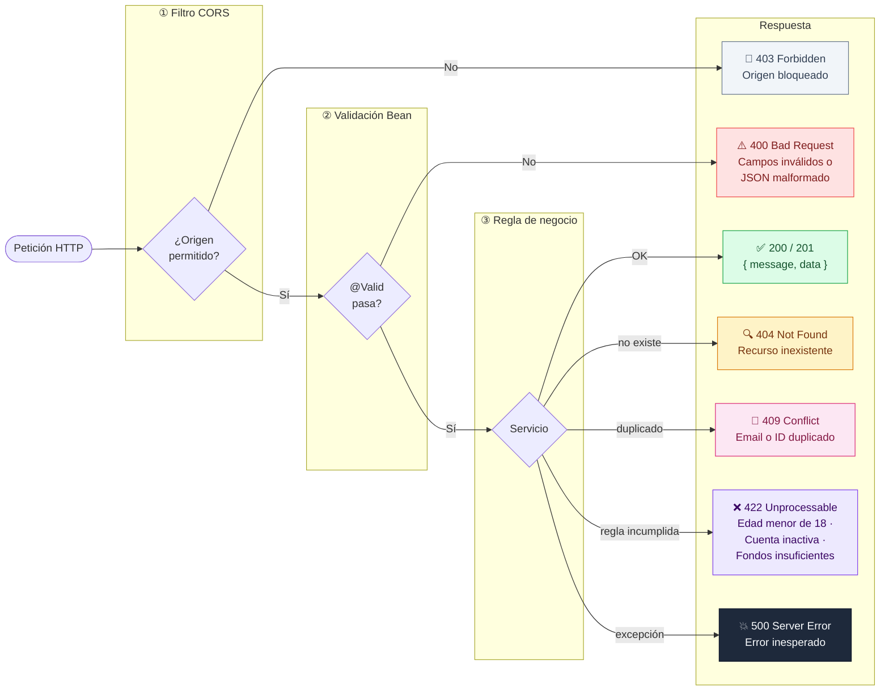
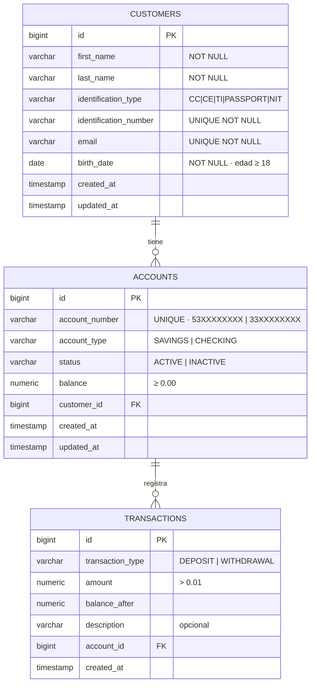
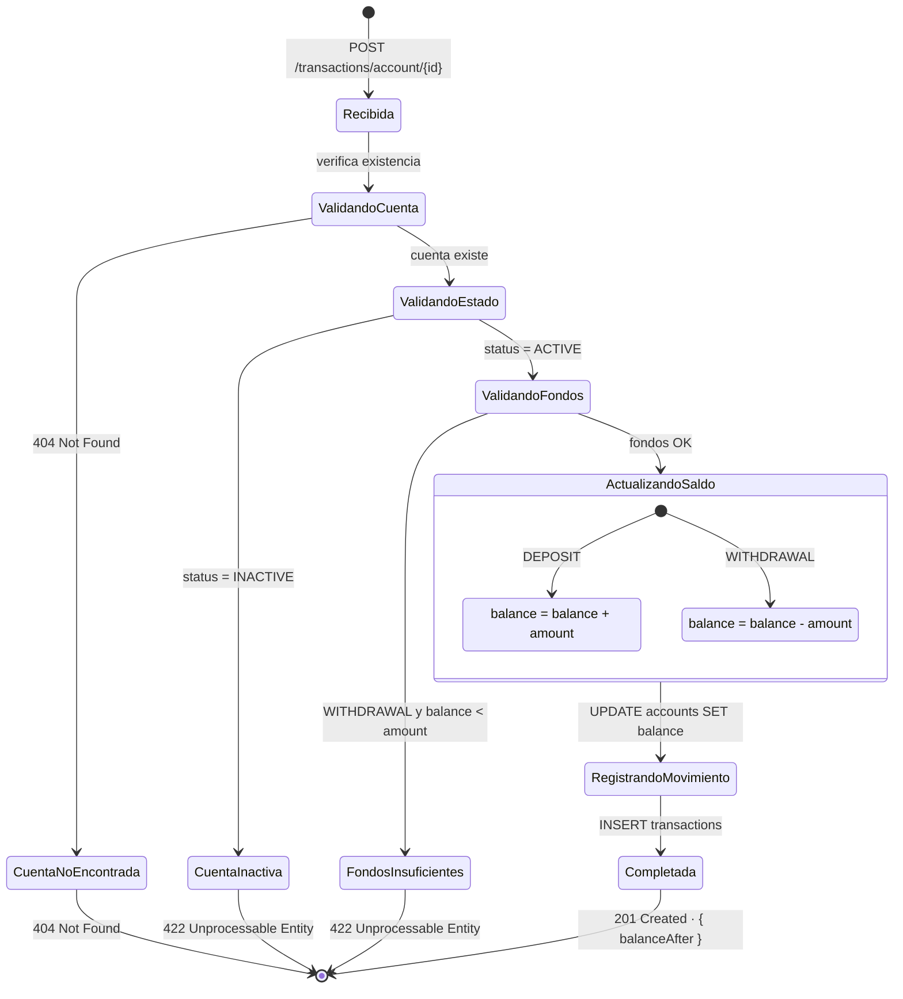

# Diagramas — Mini Sistema Financiero Flypass

---

## 1. Arquitectura de la solución



---

## 2. Manejo de errores



> **Todos los errores** pasan por `GlobalExceptionHandler`, que normaliza la respuesta en el formato:
> ```json
> { "status": 422, "error": "Unprocessable Entity", "message": "...", "timestamp": "..." }
> ```

---

## 3. Diagrama entidad-relación (BD)



---

## 4. Ciclo de vida de una transacción


