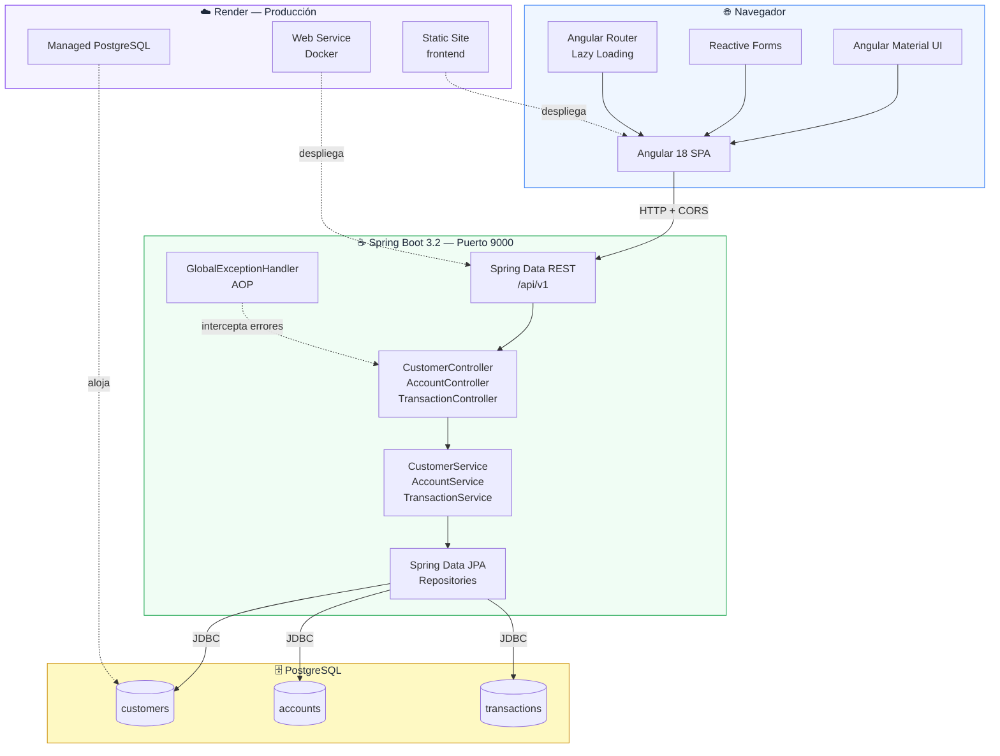
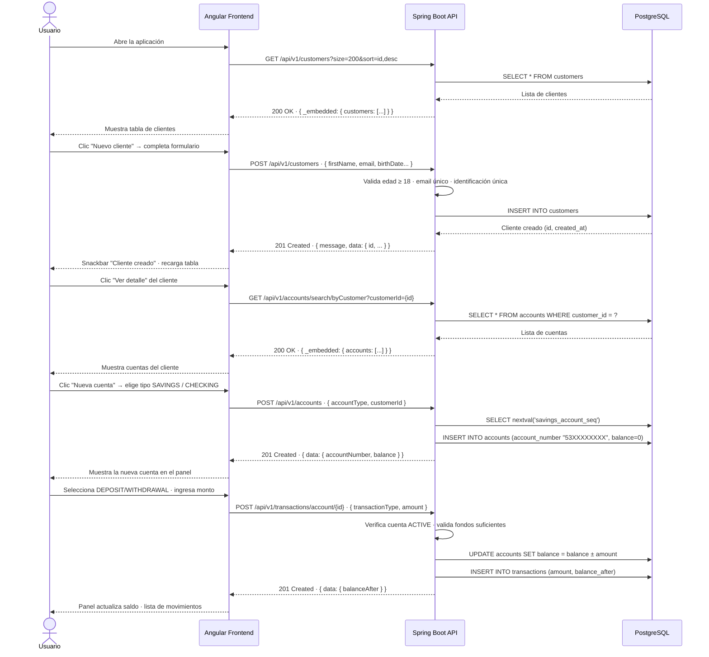
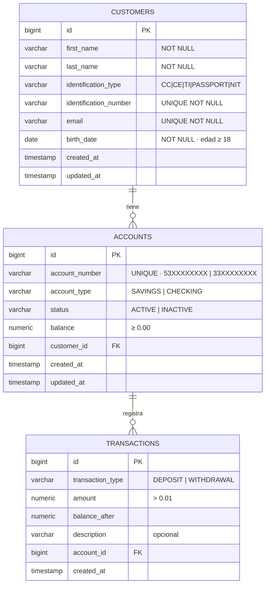
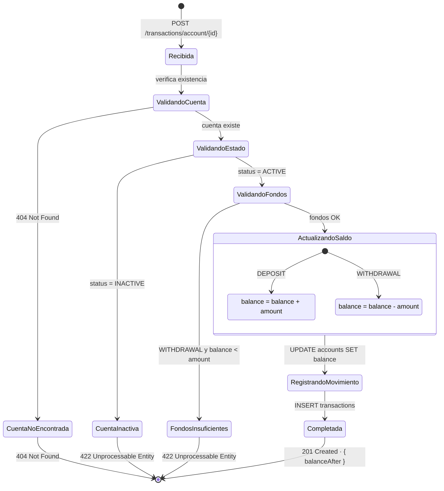

# Diagramas — Mini Sistema Financiero Flypass

---

## 1. Arquitectura de la solución



---

## 2. Flujo principal de la aplicación



---

## 3. Flujo de manejo de errores

```mermaid
flowchart TD
    REQ([Petición HTTP])
    REQ --> CORS{¿Pasa\nCorsFilter?}
    CORS -->|No — origen bloqueado| E_CORS[403 Forbidden]
    CORS -->|Sí| VALID

    VALID{¿Validación\n@Valid pasa?}
    VALID -->|No — campos inválidos| E400[400 Bad Request\nMethodArgumentNotValid\n→ lista de field errors]
    VALID -->|No — body malformado| E400B[400 Bad Request\nHttpMessageNotReadable\n→ JSON inválido / enum desconocido]
    VALID -->|Sí| BIZ

    BIZ{Regla\nde negocio}

    BIZ -->|Cliente < 18 años| E422A[422 Unprocessable Entity\n'No se permite registrar\nclientes menores de 18 años']
    BIZ -->|Email ya registrado| E409A[409 Conflict\n'Ya existe un cliente con\nese correo electrónico']
    BIZ -->|ID duplicada| E409B[409 Conflict\n'Ya existe un cliente con\nesa identificación']
    BIZ -->|Cliente con cuentas\n→ intento de borrar| E422B[422 Unprocessable Entity\n'No se puede eliminar un cliente\nque tiene cuentas asociadas']
    BIZ -->|Recurso no existe| E404[404 Not Found\n'Cliente / Cuenta no encontrada']
    BIZ -->|Cuenta INACTIVE\n→ transacción| E422C[422 Unprocessable Entity\n'La cuenta está inactiva']
    BIZ -->|Fondos insuficientes| E422D[422 Unprocessable Entity\n'Fondos insuficientes.\nSaldo actual: $X, solicitado: $Y']
    BIZ -->|OK| OK[200 / 201 Success\n{ message, data }]

    ERR_UNEXP{¿Error\ninesperado?}
    E422A & E409A & E409B & E422B & E404 & E422C & E422D --> HANDLER
    HANDLER[GlobalExceptionHandler\nregistra en log · formatea respuesta]
    HANDLER --> RESP[JSON uniforme\n{ status, error, message, timestamp, errors }]

    REQ -->|RuntimeException no\ncontrolada| ERR_UNEXP
    ERR_UNEXP --> E500[500 Internal Server Error\n'Error inesperado']
    E500 --> RESP

    style OK     fill:#dcfce7,stroke:#16a34a,color:#14532d
    style E400   fill:#fee2e2,stroke:#ef4444,color:#7f1d1d
    style E400B  fill:#fee2e2,stroke:#ef4444,color:#7f1d1d
    style E404   fill:#fef3c7,stroke:#d97706,color:#78350f
    style E409A  fill:#fce7f3,stroke:#db2777,color:#831843
    style E409B  fill:#fce7f3,stroke:#db2777,color:#831843
    style E422A  fill:#ede9fe,stroke:#7c3aed,color:#3b0764
    style E422B  fill:#ede9fe,stroke:#7c3aed,color:#3b0764
    style E422C  fill:#ede9fe,stroke:#7c3aed,color:#3b0764
    style E422D  fill:#ede9fe,stroke:#7c3aed,color:#3b0764
    style E500   fill:#1e293b,stroke:#0f172a,color:#f8fafc
    style E_CORS fill:#f1f5f9,stroke:#64748b,color:#334155
```

---

## 4. Diagrama entidad-relación (BD)



---

## 5. Ciclo de vida de una transacción


